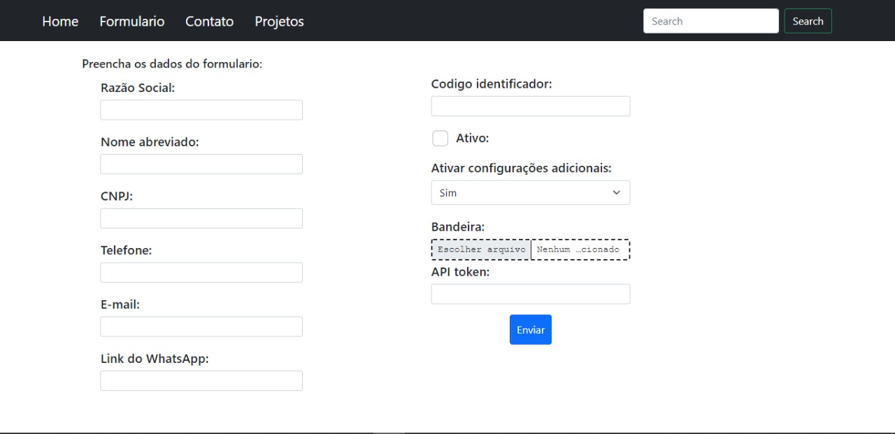

<h1 align="center">
  <span>Formulário em Flask</span>
</h1>


<p align="center">
  <a href="#-projeto">Projeto</a>&nbsp;&nbsp;&nbsp;|&nbsp;&nbsp;&nbsp;
  <a href="#-layout">Layout</a>&nbsp;&nbsp;&nbsp;|&nbsp;&nbsp;&nbsp;
  <a href="#-tecnologias-utilizadas">Tecnologias Utilizadas</a>&nbsp;&nbsp;&nbsp;|&nbsp;&nbsp;&nbsp;
  <a href="#-como-executar">Como executar</a>&nbsp;&nbsp;&nbsp;|&nbsp;&nbsp;&nbsp;
  <a href="#-licença">Licença</a>
</p>

<br>

## 💻 Projeto

Esse projeto feito em Flask, foi um teste pra estudos.

## 🔖 Layout

<p align="center">
  
</p>

## ✨ Tecnologias utilizadas

Esse projeto foi desenvolvido com as seguintes tecnologias:

- [Python](https://docs.python.org/3/)
- [Flask](https://flask.palletsprojects.com/en/2.0.x/)
- [JavaScript](https://www.w3schools.com/js/)

## 🚀 Como executar

- Você precisa instalar o [Flask](https://flask.palletsprojects.com/en/2.0.x/installation/) e [Python](https://docs.python.org/3/) para executar este projeto.

**Clone o projeto**

```bash
  git clone https://github.com/kaicLimaOliveira/FormularioFlask.git
```

**Siga os passo abaixo**

```bash
  #Instale as dependências do arquivo "requirements.txt"
  pip install -r requirements.txt

```


## 📄 Licença

Esse projeto está sob a licença MIT. Veja o arquivo [LICENSE](LICENSE) para mais detalhes.

---

<a href="https://kaicLimaOliveira.github.io">
 
 <br />
 <sub><b>Kaic de Lima Oliveira</b></sub></a>

Feito por Kaic de Lima Oliveira 👋🏽 Entre em contato!

[](https://www.facebook.com/kaic.oliveira.587) [](https://www.instagram.com/kaic.lo)
[](mailto:kaic10@outlook.com)
